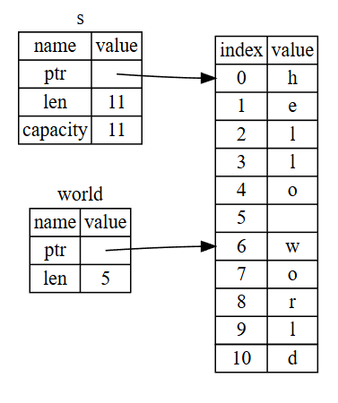

## 文字列スライス

```rust
    let s = String::from("hello world");

    let hello = &s[0..5];
    let world = &s[6..11];
```

コードのイメージ図


- 文字列スライスは、文字列の一部を参照するための型
- `&str` 型として表され、文字列の一部分を指し示す
- `[開始位置..終了位置]` の形式でスライスを作成
- 開始位置はスライスに含まれ、終了位置は含まれない
- 省略形として、`&s[..5]`（先頭から 5 文字まで）や `&s[6..]`（6 文字目から最後まで）も使用可能
