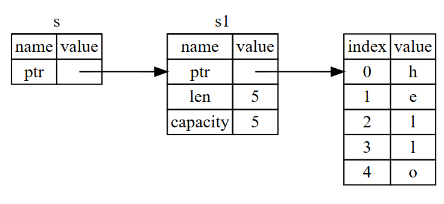

```Rust
fn main() {
    let s1 = String::from("hello");
    let len = calculate_length(&s1); // s1の参照を渡す

    println!("The length of '{}' is {}.", s1, len); // s1はまだ有効
}

fn calculate_length(s: &String) -> usize { // 参照を受け取る
    s.len()
}
```

コードのイメージ図


- 参照（Reference）は、データへのポインタのようなもので、所有権を持たずにデータを借りることができる
- `s` は `String` 型の参照を受け取り、そのデータの長さを返す
- `s1` への参照を所有しているため、`s1` は関数呼び出し後も有効であり、データの所有権は移動しない
- 関数の引数に参照を取ることを「**借用（borrowing）**」と呼ぶ

```rust
fn main() {
    let s = String::from("hello");

    change(&s);
}

fn change(some_string: &String) {
    some_string.push_str(", world");
}
```

- 上記のコードはコンパイルエラーになる
- 参照はデフォルトで不変（immutable）であり、参照を通じてデータを変更することはできない

## 可変な参照

```rust
fn main() {
    let mut s = String::from("hello");

    change(&mut s);
}

fn change(some_string: &mut String) {
    some_string.push_str(", world");
}
```

- `&mut` を使うことで、可変な参照（mutable reference）を作成できる
- 可変な参照を通じてデータを変更することが可能になる
- ただし、同じデータに対して同時に複数の可変な参照を持つことはできない（データ競合を防ぐため）
- 可変な参照と不変な参照を同時に持つこともできない
