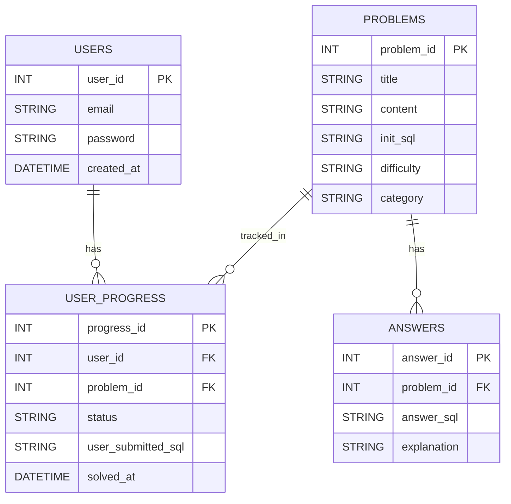

## どんなデータを管理すべきか？

- ユーザー（名前、メールアドレス、パスワード）
- 問題（タイトル、内容、難易度、カテゴリー）
- 模範解答（問題 ID、解答 SQL、解説）
- ユーザーの学習進捗

## テーブル構成案

1. users（ユーザー）テーブル
   - user_id
   - email
   - password
   - created_at
2. problems（問題）テーブル
   - problem_id
   - title
   - content
   - init_sql
   - difficulty
   - category
3. answers（模範解答）テーブル
   - answer_id
   - problem_id
   - answer_sql
   - explanation
4. user_progress（学習進捗）テーブル
   - progress_id
   - user_id
   - problem_id
   - status
   - user_submitted_sql
   - solved_at

## ER 図のイメージ（あくまでイメージなので、確定ではない）

