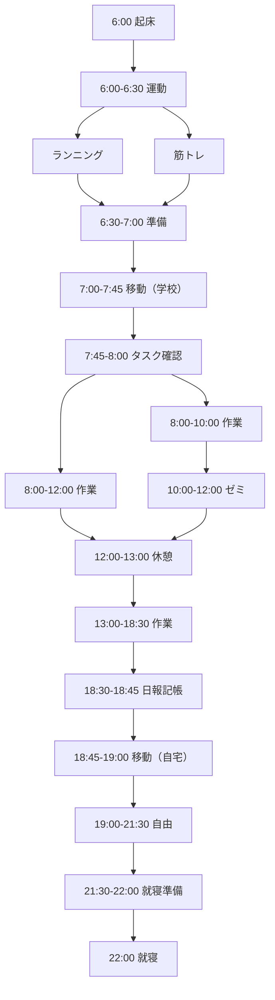
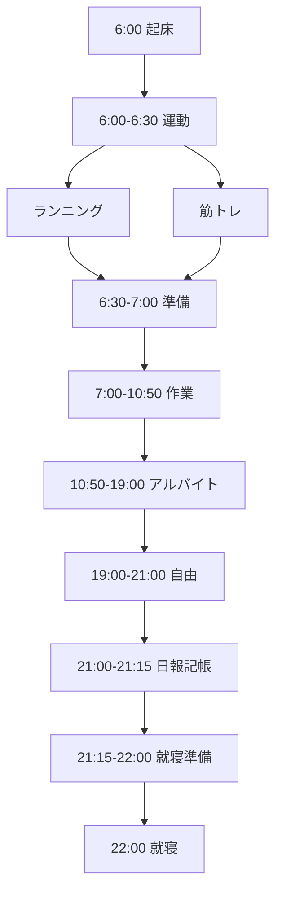

## 研究室

```mermaid
graph TD

A[6:00 起床]
B[6:00-6:30 運動]
C[ランニング]
D[筋トレ]
E[6:30-7:00 準備]
F[7:00-7:45 移動（学校）]
G[7:45-8:00 タスク確認]
H[8:00-12:00 作業]
I[8:00-10:00 作業]
J[10:00-12:00 ゼミ]
K[12:00-13:00 休憩]
L[13:00-18:30 作業]
M[18:30-18:45 日報記帳]
N[18:45-19:00 移動（自宅）]
O[19:00-21:30 自由]
P[21:30-22:00 就寝準備]
Q[22:00 就寝]

A --> B
B --> C
B --> D
C --> E
D --> E
E --> F
F --> G
G --> H
G --> I
I --> J
H --> K
J --> K
K --> L
L --> M
M --> N
N --> O
O --> P
P --> Q

```

## アルバイト

```mermaid
graph TD

A[6:00 起床]
B[6:00-6:30 運動]
C[ランニング]
D[筋トレ]
E[6:30-7:00 準備]
F[7:00-10:50 作業]
G[10:50-19:00 アルバイト]
H[19:00-21:00 自由]
I[21:00-21:15 日報記帳]
J[21:15-22:00 就寝準備]
K[22:00 就寝]

A --> B
B --> C
B --> D
C --> E
D --> E
E --> F
F --> G
G --> H
H --> I
I --> J
J --> K

```
